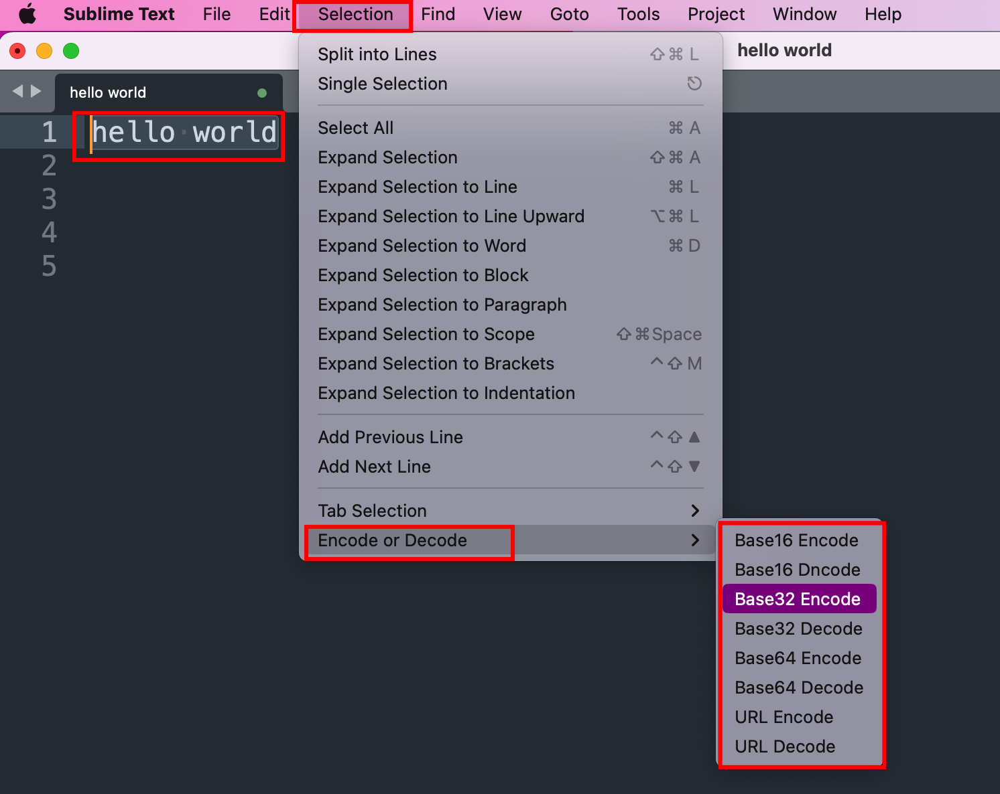

# Encoding Toolbox Sublime Text Plugin

The Encoding Toolbox Sublime Text Plugin is a versatile plugin that provides easy-to-use commands for encoding and decoding text in various formats, right from within Sublime Text. It simplifies the process of encoding and decoding text, making it a useful tool for developers, data analysts, and anyone working with encoded data.

There are several reasons why I decided to create the Encoding Toolbox Sublime Text Plugin:

**(1)Lack of Suitable Existing Plugins**: Despite searching through Package Control for plugins with encoding and decoding features, I couldn't find one that suited my needs perfectly. While there may be plugins with similar functionalities, they might be difficult to discover amidst the vast array of plugins available on the Sublime Text Package Control.

**(2)Convenience and Efficiency**: I often encounter encoded data while working on various projects. Instead of relying on online tools or separate applications to decode this data, I wanted a solution that allowed me to perform encoding and decoding directly within Sublime Text. Integrating these features into my text editor offers convenience and saves time by eliminating the need to switch between different tools or open web browsers.

**(3)Inconvenient decoding with local tools**: Although I could use Python locally to decode data, it often involves repetitive steps like opening the terminal, importing modules, defining strings, and decoding them. With this plugin, I can now quickly decode selected text right within Sublime Text without the hassle of switching between applications.

## Features

The Encoding Toolbox Sublime Text Plugin includes the following features:

- Base16 (Hex) Encoding and Decoding
- Base32 Encoding and Decoding
- Base64 Encoding and Decoding
- URL Encoding and Decoding

The plugin currently only provides these features listed above. If you have any useful feature requests, suggestions, or improvements, I welcome you to contribute and share your ideas on the GitHub repository for this project.

## Installation

To install the Encoding Toolbox Sublime Text Plugin, follow these steps:

1. Open Sublime Text.
2. Go to the "Packages" directory by selecting "Preferences" > "Browse Packages" from the menu. This will open the "Packages" directory in your file explorer.
3. Using `git`, clone the Encoding Toolbox plugin repository into the "Packages" folder.
4. To reduce the file size, you can manually delete the files README.md and the img directory from the Encoding-Toolbox folder.
5. Restart Sublime Text.

## How to Use

### Method 1: Using Menu Options

1. Open Sublime Text and select the text you want to encode or decode.
2. Go to the "Selection" menu, then choose "Encode or Decode," and finally select the specific encoding or decoding option:

### Method 2: Using Command Palette

1. Open Sublime Text and select the text you want to encode or decode.
2. Open the Command Palette by pressing `Ctrl+Shift+P` (Windows/Linux) or `Cmd+Shift+P` (macOS).

3. Type "Encode or Decode" to filter the available commands.
4. Select the specific encoding or decoding option from the list:

## Compatibility

This plugin is compatible with **Sublime Text 3** and above.

Please note that Sublime Text 2 is not supported. Ensure you have the latest version of Sublime Text installed to enjoy the full functionality of this plugin.

## Troubleshooting

If you encounter any issues or errors while using the Encoding Toolbox Sublime Text Plugin, please ensure that you have followed the installation instructions correctly and have the required dependencies installed (e.g., `base64`, etc.). If the problem persists, feel free to open an issue on the GitHub repository for this plugin.

## License

This plugin is open-source and released under the MIT License.

